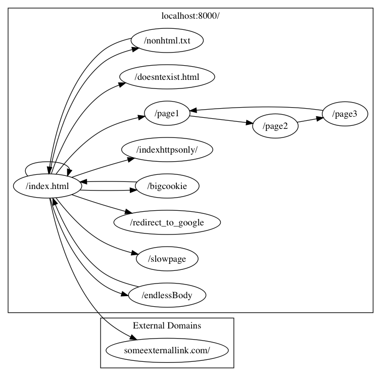

# Badserver

A HTTP(s) server which simulates a website. Useful for http client and scraper testing. It does a few quite naughty things.

* Serves endless pages which will send you a line of html every second **forever**
* Serves a page containing absurdly large cookies (and far too many of them)
* Pretends to have a local relative link that really does a 302 redirect to google

## Quickstart

If you just want to run it it's hosted on dockerhub

```
docker run -p 8000:8000 -p 8001:8001 transactcharlie/badserver
```

## Sitemap
If you write a crawler it should returns results similar to this:


